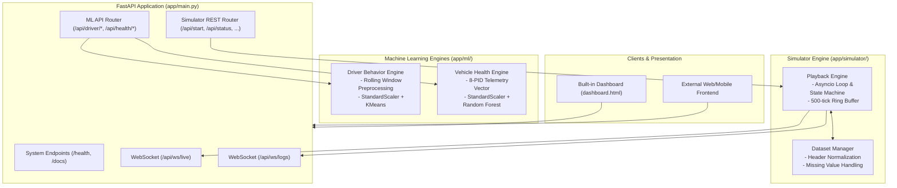
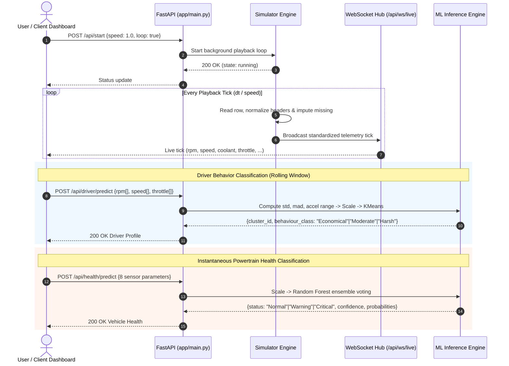

# ECU Guardian Backend

**ML-powered vehicle health API + OBD-II data simulator, in one deployable FastAPI service.**

Part of the *Smart Vehicle ECU Monitoring and Predictive Maintenance* major project (VTU, Dept. of ICBS, St Joseph Engineering College).

[](https://www.python.org/)
[](https://fastapi.tiangolo.com/)
[](#license)

---

## Table of Contents

- [Overview](#overview)
- [Architecture & End-to-End Workflow](#architecture--end-to-end-workflow)
- [Documentation & Model Deep-Dives](#documentation--model-deep-dives)
- [Why the simulator and ML API are merged](#why-the-simulator-and-ml-api-are-merged)
- [Project Structure](#project-structure)
- [Getting Started](#getting-started)
- [API Reference](#api-reference)
  - [Machine Learning Endpoints](#machine-learning-endpoints)
  - [Simulator — Dataset Management](#simulator--dataset-management)
  - [Simulator — Playback Control](#simulator--playback-control)
  - [Simulator — Live Data](#simulator--live-data)
  - [Simulator — WebSockets](#simulator--websockets)
  - [System](#system)
- [Standard Sensor Field Reference](#standard-sensor-field-reference)
- [Testing POST Endpoints](#testing-post-endpoints)
- [Deployment](#deployment)
- [Extending the System](#extending-the-system)
- [Roadmap](#roadmap)

---

## Overview

This service exposes two core automotive systems behind a single base URL:

1. **Machine learning inference** — classifies driver behaviour (rolling window) and vehicle health (powertrain snapshot) from OBD-II parameters.
2. **An OBD-II simulator** — plays back recorded vehicle datasets row by row, in real time, over REST and WebSockets, so frontend dashboards or client applications can be built and evaluated without physical vehicle hardware.

Both are independently useful and modular, but ship as one process to enable single-click deployment with zero double cold-starts.

---

## Architecture & End-to-End Workflow

### High-Level System Architecture



### End-to-End Data & Inference Flow



The two halves don't import from each other. Nothing in `app/ml/` knows the simulator exists, and nothing in `app/simulator/` knows the ML models exist — `app/main.py` is the only place they are wired together.

---

## Documentation & Model Deep-Dives

Detailed technical documentation and model specifications are maintained right here in the `docs/` directory:

- 📖 **[End-to-End System Architecture Guide](end_to_end_system_architecture.md)** — Comprehensive deep dive into the simulation engine, event distribution, data normalization dictionaries, and complete API specifications.
- 🤖 **[K-Means Driver Behavior Model](kmeans_driver_behavior.md)** — Explains the 6-D statistical feature engineering (std, MAD, acceleration dynamic range), normalization, cluster mapping, and inference lifecycle.
- 🌲 **[Random Forest Vehicle Health Model](random_forest_vehicle_health.md)** — Explains the 8-sensor powertrain telemetry features, ensemble probability estimation, confidence metrics, and physical fault signatures.
- 🔬 **[Hybrid LSTM + Random Forest Pipeline](driver_behaviour_lstm_rf.md)** — Architectural design for the next-generation hybrid sequence-labelling pipeline.

---

## Why the simulator and ML API are merged

Deployed as one Render/Railway free-tier service instead of two, because:

- **One cold start, not two.** Free-tier services sleep after ~15 minutes of inactivity. Two separate services means two independent wake-up delays (30–60s each) — if a demo request happens to hit whichever one is still asleep, that's a hang at the worst possible moment. One service, one wake-up.
- **One URL for the frontend.** No cross-origin configuration between "your own two backends."
- **No real reason to split them yet.** The simulator only needs to be its own service once it's replaced by real hardware or needs to scale past a single demo vehicle — see [Extending the System](#extending-the-system).

---

## Project Structure

```
ecu-backend/
├── app/
│   ├── main.py                      # Entry point — mounts both APIs, no route collisions
│   ├── ml/
│   │   ├── driver_behaviour.py       # KMeans driver behaviour classifier
│   │   └── health_classifier.py      # Random Forest vehicle health classifier
│   ├── simulator/
│   │   ├── config.py                  # Simulator settings (env-var overridable)
│   │   ├── services/
│   │   │   ├── dataset_manager.py     # Loads/cleans CSV & XLSX OBD-II datasets
│   │   │   └── simulator.py            # Playback engine (pause/resume/speed/loop)
│   │   └── api/
│   │       ├── routes.py               # REST endpoints for datasets + playback
│   │       └── websocket.py            # WebSocket connection manager
│   └── static/
│       └── dashboard.html            # Built-in control dashboard (single file, no build step)
├── datasets/                        # Bundled sample OBD-II datasets
├── docs/                            # Comprehensive technical documentation & model specifications
│   ├── README.md                    # This primary project guide & docs hub
│   ├── end_to_end_system_architecture.md # Full end-to-end system guide & workflow
│   ├── kmeans_driver_behavior.md    # K-Means driver behavior model doc
│   ├── random_forest_vehicle_health.md # Random Forest health classifier doc
│   └── driver_behaviour_lstm_rf.md  # Next-gen LSTM + RF hybrid pipeline doc
├── models/                          # Trained model artifacts (.joblib / .pkl)
│   ├── kmeans_driver_behavior_model.joblib
│   ├── standard_scaler_driver_behavior.joblib
│   ├── random_forest_health.pkl
│   └── scaler_health.pkl
├── uploads/                         # User-uploaded datasets (gitignored)
├── requirements.txt
├── Dockerfile
└── run.py                           # Local dev entrypoint
```

---

## Getting Started

### Prerequisites
- Python 3.11+
- pip

### Installation
```bash
git clone <your-repo-url>
cd ecu-backend
python3 -m venv venv
source venv/bin/activate        # Windows: venv\Scripts\activate
pip install -r requirements.txt
```

### Run
```bash
python run.py
# equivalently: uvicorn app.main:app --reload --port 8000
```

### Explore
| What | Where |
|---|---|
| Simulator control dashboard | http://localhost:8000 |
| Interactive API docs (Swagger) | http://localhost:8000/docs |
| Alternative API docs (ReDoc) | http://localhost:8000/redoc |
| Health check | http://localhost:8000/health |

A sample dataset is bundled in `datasets/` and loads automatically at
startup — the simulator works out of the box with zero configuration.

---

## API Reference

Base URL (local): `http://localhost:8000`
Base URL (deployed): `https://<your-app>.onrender.com`

### Machine Learning Endpoints

#### `POST /api/driver/predict`
Classifies driver behaviour from a rolling window of OBD-II readings using a pre-trained KMeans model.

**Request body**
```json
{
  "rpm_values": [800, 850, 900, 1200, 1500, 1400, 1300],
  "speed_values": [0, 0, 5, 20, 35, 40, 38],
  "throttle_values": [10, 12, 15, 30, 45, 40, 35]
}
```
Minimum 5 data points per array; all three arrays must be the same length.

**Response `200`**
```json
{
  "cluster_id": 0,
  "behaviour_class": "Moderate",
  "features_debug": {
    "Engine RPM [RPM]_std": 262.83,
    "Engine RPM [RPM]_mad": 150.0,
    "Vehicle Speed Sensor [km/h]_mad": 7.0,
    "acceleration_std": 6.52,
    "acceleration_range": 17.0,
    "Absolute Throttle Position [%]_std": 13.22
  }
}
```

**Errors**
| Code | Cause |
|---|---|
| `400` | Fewer than 5 data points supplied |
| `500` | Internal model/feature-extraction error |

---

#### `POST /api/health/predict`
Classifies a single vehicle telemetry snapshot into a health status using a pre-trained Random Forest model.

**Request body**
```json
{
  "rpm": 1500,
  "throttle_pos": 30,
  "map_kpa": 97,
  "maf": 10,
  "coolant_temp": 90,
  "intake_air_temp": 25,
  "ambient_temp": 24,
  "pedal_d": 20
}
```

**Response `200`**
```json
{
  "status": "Normal",
  "confidence": 0.9874,
  "probabilities": {
    "Normal": 0.9874,
    "Warning": 0.0126
  }
}
```

**Errors**
| Code | Cause |
|---|---|
| `500` | Internal model error (e.g. malformed input) |

---

### Simulator — Dataset Management

#### `GET /api/datasets`
Lists every dataset available on disk (bundled + uploaded), with cleaning metadata.

**Response `200`**
```json
{
  "datasets": [
    {
      "dataset_id": "575a02c5-501c-44d0-b487-be107fce2957",
      "filename": "2017-07-05_Seat_Leon_S_KA_Normal.csv",
      "row_count": 30817,
      "duration_seconds": 3080.3,
      "missing_value_report": {
        "coolant_temp": 30668,
        "rpm": 1,
        "vss": 2
      }
    }
  ]
}
```

#### `POST /api/upload`
Uploads a new dataset. Accepts `.csv`, `.xlsx`, `.xls`. `multipart/form-data`, field name `file`.

```bash
curl -X POST http://localhost:8000/api/upload -F "file=@my_dataset.csv"
```

**Response `201`**
```json
{
  "dataset_id": "a1b2c3d4-...",
  "filename": "my_dataset.csv",
  "row_count": 5000,
  "duration_seconds": 500.0,
  "missing_value_report": { "coolant_temp": 12 }
}
```
**Errors:** `400` if the file extension is unsupported or the file can't be parsed.

#### `DELETE /api/datasets/{dataset_id}`
Deletes an uploaded dataset. Bundled sample datasets are protected — they're removed from
the in-memory cache but never deleted from disk.

**Response `200`:** `{"deleted": true}` · **Errors:** `404` if `dataset_id` doesn't exist.

#### `PATCH /api/datasets/{dataset_id}/rename`
```json
{ "dataset_id": "a1b2c3d4-...", "new_name": "highway_run_2" }
```
**Response `200`:** `{"renamed": true}` · **Errors:** `404` if not found or rename fails.

#### `POST /api/change-dataset`
Switches the active dataset. If playback is currently running, it restarts from row 0 on the new dataset.
```json
{ "dataset_id": "a1b2c3d4-..." }
```
**Response `200`:** `{"active_dataset_id": "a1b2c3d4-..."}`

---

### Simulator — Playback Control

All endpoints below return the same **status object** shape:
```json
{
  "state": "running",
  "dataset_id": "575a02c5-...",
  "dataset_name": "2017-07-05_Seat_Leon_S_KA_Normal.csv",
  "current_row": 105,
  "total_rows": 30817,
  "speed": 10.0,
  "loop": true,
  "elapsed_playback_seconds": 1049.0,
  "dataset_duration_seconds": 3080.3,
  "playback_percent": 0.34
}
```
`state` is one of: `stopped` · `running` · `paused` · `finished`

| Endpoint | Body | Notes |
|---|---|---|
| `POST /api/start` | `{"dataset_id"?, "speed"?, "loop"?}` (all optional) | Starts streaming from row 0. Loads the default dataset if none is active. `400` if no dataset is available. |
| `POST /api/pause` | — | No-op unless currently `running`. |
| `POST /api/resume` | — | No-op unless currently `paused`. |
| `POST /api/stop` | — | Cancels the playback task entirely. |
| `POST /api/reset` | — | Stops and rewinds to row 0. |
| `POST /api/speed` | `{"speed": 5}` | Must be one of `0.5, 1, 2, 5, 10`. `400` otherwise. |
| `POST /api/loop` | `{"loop": true}` | Toggle looping when the dataset ends. |
| `GET /api/status` | — | Current status object (also polled by the dashboard every 2s as a WebSocket backstop). |

---

### Simulator — Live Data

#### `GET /api/live-data`
Returns the most recent telemetry tick.

**Response `200`**
```json
{
  "row_index": 105,
  "total_rows": 30817,
  "elapsed_seconds": 1049.0,
  "playback_percent": 0.34,
  "data": {
    "coolant_temp": 33.0,
    "map_kpa": 97.0,
    "rpm": 798.0,
    "vss": 0.0,
    "intake_air_temp": 32.0,
    "maf": 8.74,
    "throttle_pos": 83.1,
    "ambient_temp": 24.0,
    "pedal_d": 14.1,
    "pedal_e": 14.5
  }
}
```
**Errors:** `404` if the simulator hasn't been started yet.

#### `GET /api/history?limit=100`
Returns the most recent `limit` ticks (default 100, ring buffer capped at 500 — see `HISTORY_BUFFER_SIZE`). Useful for backfilling a chart on page load before the WebSocket starts pushing new points.

---

### Simulator — WebSockets

#### `WS /api/ws/live`
Pushes a telemetry tick (same shape as `/api/live-data`) every time the simulator advances a row. No client→server messages expected.

```js
const ws = new WebSocket("wss://<your-app>/api/ws/live");
ws.onmessage = (event) => {
  const tick = JSON.parse(event.data);
  console.log(tick.data.rpm, tick.data.vss);
};
```

#### `WS /api/ws/logs`
Pushes simulator log events (dataset loaded, streaming started/paused, warnings, errors) as they happen.
```json
{ "level": "info", "message": "Streaming started (speed=10.0x, loop=true)", "timestamp": 1751900000.123 }
```

**Why WebSockets over Server-Sent Events:** the dashboard needs continuous
low-latency push (ticks every 0.1–1s) and WebSockets leave the door open
for bidirectional messages later — e.g. a future mobile app sending
control commands over the same socket. Browser and mobile WebView support
is consistent, making it the safer default for this use case.

---

### System

| Endpoint | Purpose |
|---|---|
| `GET /health` | Health check (used by hosting platforms to detect a live instance) |
| `GET /` | Serves the simulator control dashboard |
| `GET /docs` | Swagger UI — interactive, supports "Try it out" for every POST endpoint |
| `GET /redoc` | ReDoc — clean read-only API reference |

---

## Standard Sensor Field Reference

Every simulator tick — from the WebSocket, `/api/live-data`, and
`/api/history` — uses these exact keys, regardless of what the original
dataset's column headers were called:

| Field | Meaning | Unit |
|---|---|---|
| `coolant_temp` | Engine coolant temperature | °C |
| `map_kpa` | Intake manifold absolute pressure | kPa |
| `rpm` | Engine RPM | RPM |
| `vss` | Vehicle speed | km/h |
| `intake_air_temp` | Intake air temperature | °C |
| `maf` | Mass air flow | g/s |
| `throttle_pos` | Absolute throttle position | % |
| `ambient_temp` | Ambient air temperature | °C |
| `pedal_d` | Accelerator pedal position D | % |
| `pedal_e` | Accelerator pedal position E | % |

Keep any ML inference or dashboard code pointed at these names — it's the
contract that lets you swap datasets, and later swap in real OBD-II
hardware, without touching downstream code.

---

## Testing POST Endpoints

A browser address bar can only ever send `GET` — typing a URL and hitting
Enter will never trigger a `POST`, even if the endpoint exists and works
correctly. To exercise POST endpoints:

- **Swagger UI** — visit `/docs`, expand an endpoint, click "Try it out"
- **curl**
  ```bash
  curl -X POST http://localhost:8000/api/health/predict \
    -H "Content-Type: application/json" \
    -d '{"rpm":1500,"throttle_pos":30,"map_kpa":97,"maf":10,"coolant_temp":90,"intake_air_temp":25,"ambient_temp":24,"pedal_d":20}'
  ```
- **Postman / Insomnia** — import the OpenAPI schema from `/openapi.json`
- **The dashboard itself** — all its buttons already issue correct `fetch(..., {method: "POST"})` calls

---

## Deployment

**Recommended: [Render](https://render.com)** — free tier, no credit card, Dockerfile deploys work out of the box.

1. Push this repository to GitHub.
2. Render → **New +** → **Web Service** → connect the repo.
3. Render auto-detects the `Dockerfile`. Leave build/start commands blank.
4. Instance type: **Free**.
5. **Create Web Service** — first deploy takes 3–5 minutes.
6. You'll get a URL like `https://your-app-name.onrender.com`.

**Free tier caveats:**
- Services sleep after ~15 minutes of inactivity and take 30–60s to wake
  on the next request. Open the URL a few minutes before a live demo to
  warm it up.
- The filesystem is not persistent across restarts/redeploys on the free
  tier — uploaded datasets won't survive a redeploy. Bundled datasets in
  `datasets/` (committed to the repo) always come back since they're part
  of the image.

**For a live demo with zero cold-start risk**, run locally and tunnel it:
```bash
uvicorn app.main:app --port 8000
ngrok http 8000        # or: npx localtunnel --port 8000
```

---

## Extending the System

### Adding a real OBD-II adapter
Only `app/simulator/services/simulator.py` needs a sibling, not a rewrite.
Create e.g. `app/simulator/services/live_adapter.py` implementing the same
tick-producing shape (using [`python-OBD`](https://python-obd.readthedocs.io/)
against a real ELM327 adapter instead of reading DataFrame rows), then
swap which one `app/main.py` instantiates behind a config flag. The API
layer, dashboard, and any ML code built against the
[standard field names](#standard-sensor-field-reference) keep working unchanged.

### Splitting the simulator into its own service
Deploy `app/simulator/` (plus `app/static/`, `datasets/`, `uploads/`) as
its own Render service, and point the frontend at two base URLs instead of
one. No internal rewrite required — this is exactly why it stayed a
self-contained package instead of being fused directly into `main.py`.

---

## Roadmap

- [ ] Wire simulator ticks directly into `/api/health/predict` so health
      classification runs automatically on live data instead of requiring
      a manual request per snapshot
- [ ] Anomaly detection (Isolation Forest)
- [ ] Composite Vehicle Health Score (0–100, weighted aggregation)
- [ ] Predictive maintenance / Remaining Useful Life forecasting
- [ ] Fuel efficiency prediction
- [ ] DTC (Diagnostic Trouble Code) retrieval and decoding
- [ ] Persistent storage (PostgreSQL) and auth (JWT + bcrypt)

---

## License

Academic project — St Joseph Engineering College, VTU Belagavi. Not licensed for commercial redistribution.
