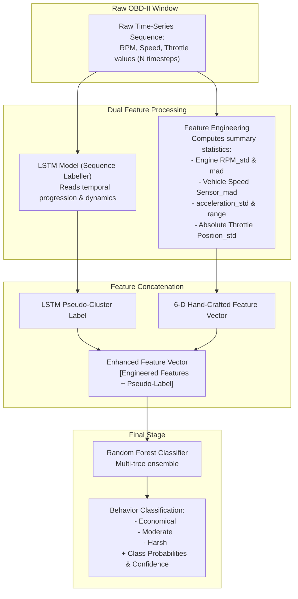

# Driver Behavior Profiling — LSTM + Random Forest Pipeline

## Overview
The Driver Behavior Profiling module has been designed to transition from a single-stage **K-Means clustering** approach to a **two-stage hybrid pipeline**:

1. **LSTM (Labelling Stage)** — consumes a raw time-series window of driving telemetry and outputs a cluster-like pseudo-label representing the underlying driving pattern in that window (replacing the role K-Means previously played).
2. **Random Forest (Classification Stage)** — takes the engineered statistical features (same features used in the original K-Means version: RPM std, RPM MAD, speed MAD, acceleration std/range, throttle std) **plus** the LSTM's pseudo-label as an additional input feature, and classifies the window into the final driver behavior category: **Economical / Moderate / Harsh**.

This upgrades the single-model flow (`raw window -> engineered features -> K-Means -> cluster label`) to a two-model flow where the LSTM contributes a learned, sequence-aware temporal representation that the Random Forest combines with domain-crafted statistical features to produce the final classification.

---

## Pipeline Architecture



---

## Stage 1: LSTM (Labelling)

**Purpose:** Replace K-Means as the source of the underlying driving-pattern label. Instead of clustering purely on hand-crafted statistical features, the LSTM reads the raw sequential telemetry directly, capturing temporal transitions (e.g. how acceleration or braking develops *within* a window) that summary statistics alone can lose.

**Input:** Raw time-series window — the underlying signals (RPM, Speed, Throttle) at their native per-timestep resolution, rather than summarized statistics.

**Output:** A pseudo-label per window — analogous to a cluster ID, produced by the recurrent neural network. This label represents an intermediate learned state of "which driving pattern signature this sequence resembles."

**Role in the pipeline:** Functions as an automated sequence encoder. Rather than directly mapping to classes via a static lookup, its output is passed forward as an informed feature to the Random Forest.

---

## Stage 2: Random Forest (Classification)

**Purpose:** Produce the final Economical / Moderate / Harsh classification along with calibrated class confidence.

**Input features:**
- All the original engineered features from the K-Means-era pipeline:
  - `Engine RPM [RPM]_std`
  - `Engine RPM [RPM]_mad`
  - `Vehicle Speed Sensor [km/h]_mad`
  - `acceleration_std`
  - `acceleration_range`
  - `Absolute Throttle Position [%]_std`
- Plus the **LSTM pseudo-label** for the same window, incorporated as an additional feature column.

**Output:** Final classification — `Economical`, `Moderate`, or `Harsh` — accompanied by class probabilities and confidence scores, aligned with the API pattern established in the vehicle health classifier.

**Why RF on top of LSTM instead of LSTM predicting directly:** The Random Forest acts as a robust, interpretable decision layer. It balances the LSTM's sequence-derived representation against established statistical features, preventing the deep learning model from overfitting or misinterpreting short transient anomalies.

---

## Comparison of Methodologies

| Aspect | Baseline: K-Means | Next-Gen: LSTM + RF Hybrid |
| :--- | :--- | :--- |
| **Input to Labelling** | Engineered summary features only | Raw temporal window sequence |
| **Temporal Awareness** | None (time order is discarded by summary stats) | Full sequence context (recurrent cell memory) |
| **Final Classification** | Fixed centroid mapping (`CLUSTER_MAP`) | Supervised Random Forest decision trees |
| **Model Count** | 1 (KMeans + Scaler) | 2 (LSTM Labeller + RF Classifier + Scalers) |
| **Output Information** | Hard cluster ID and category name | Category name + probability distribution + confidence |

---

## Expected Artifacts

When integrated into `models/`, the hybrid pipeline will utilize:

```
models/lstm_driver_behavior.keras          # LSTM sequence labelling model
models/lstm_driver_behavior_scaler.joblib  # Scaler for raw window inputs
models/rf_driver_behavior.joblib           # Random Forest classifier
models/rf_driver_behavior_scaler.joblib    # Scaler for combined feature vector
```

---

## Related Documentation
- [K-Means Driver Behavior Model](file:///e:/MP-ECU/ecu-backend/docs/kmeans_driver_behavior.md)
- [Random Forest Vehicle Health Model](file:///e:/MP-ECU/ecu-backend/docs/random_forest_vehicle_health.md)
- [End-to-End System Architecture](file:///e:/MP-ECU/ecu-backend/docs/end_to_end_system_architecture.md)
