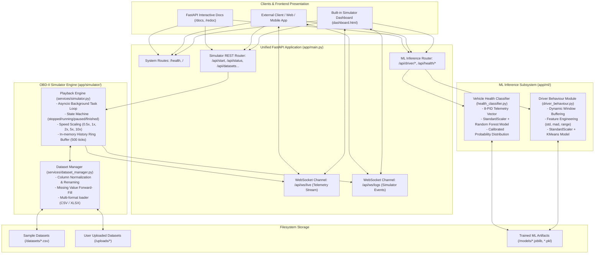
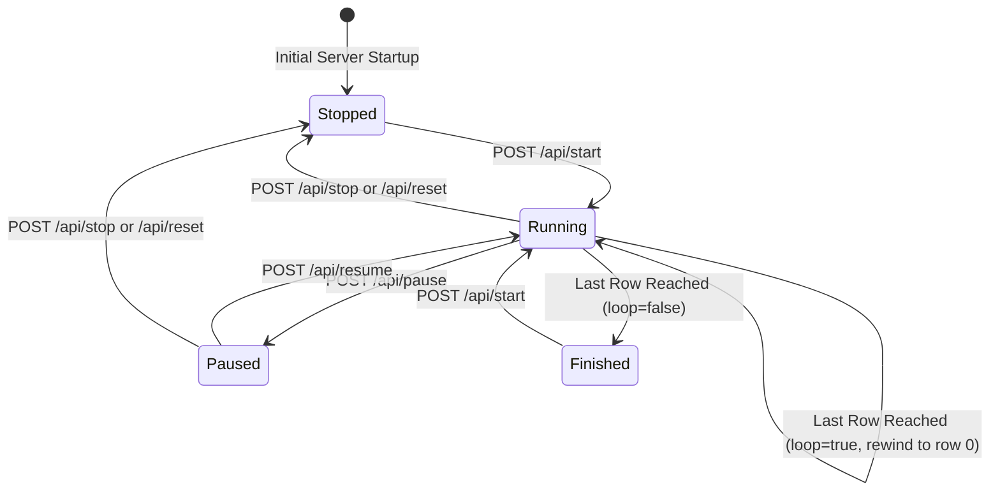
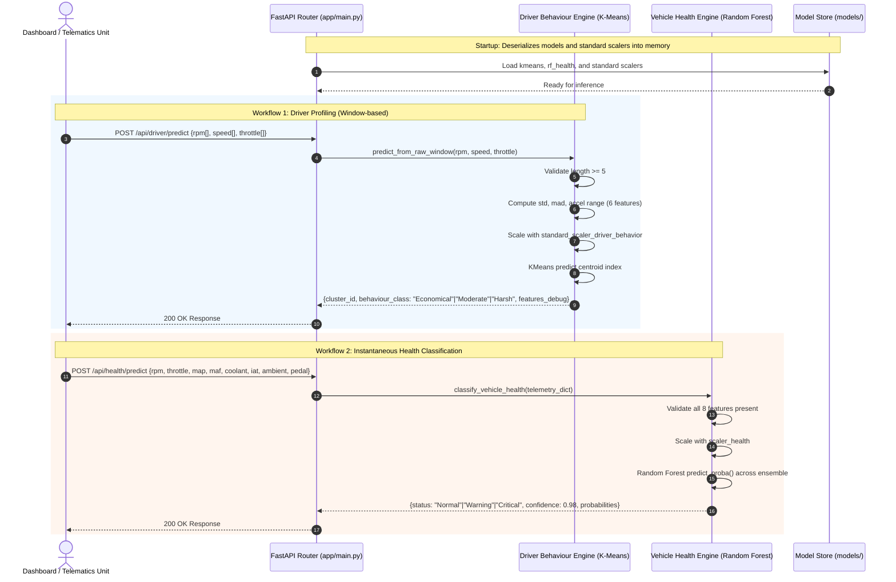
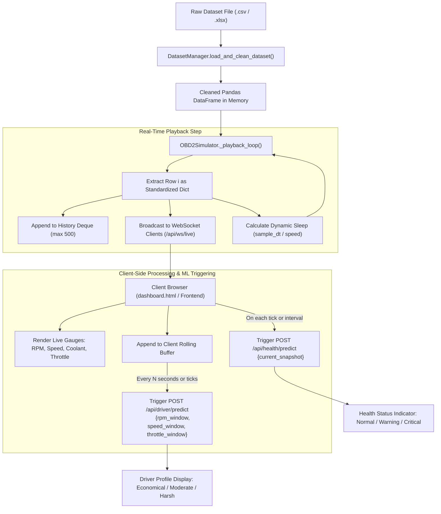

# Autovue: End-to-End System Architecture & Workflow Guide

This document provides an exhaustive, end-to-end technical explanation of how the **ECU Guardian Backend** operates. It covers system motivation, architecture, data flow, telemetry simulation, machine learning inference engines, real-time streaming, and API protocols.

---

## 1. System Mission & Core Philosophy

**AutoVue** is an automotive telemetry and predictive intelligence platform developed under the *Smart Vehicle ECU Monitoring and Predictive Maintenance* project (VTU, Dept. of ICBS, St Joseph Engineering College).

### The Problem
Traditional automotive telemetry development faces two major hurdles:
1. **Hardware Dependence**: Testing machine learning models or frontend dashboards requires physical access to a vehicle and an OBD-II dongle (ELM327) or expensive hardware-in-the-loop (HIL) test benches.
2. **Disconnected Diagnostics**: Existing commercial OBD-II scanners only report Diagnostic Trouble Codes (DTCs) after a catastrophic threshold breach has already occurred, offering little real-time assessment of driver stress or early mechanical degradation.

### The Unified Solution
AutoVue combines two core subsystems into a single unified, deployable FastAPI application:
1. **Real-Time OBD-II Simulator**: Replays high-resolution, multi-sensor driving datasets (CSV/XLSX) row-by-row with controllable playback speed ($0.5\times$ to $10\times$), looping, pausing, and live WebSocket broadcasting.
2. **Machine Learning Intelligence Hub**: Stateless, low-latency endpoints that ingest sensor telemetry to classify:
   - **Driver Behavior**: Profiling aggression levels (`Economical`, `Moderate`, `Harsh`) over rolling windows.
   - **Powertrain Health**: Multi-sensor anomaly detection (`Normal`, `Warning`, `Critical`) with probability confidence scores.

By unifying both components into a single process, the application avoids multi-container cold starts on hosting providers (like Render or Railway) and presents a single, cohesive API surface to client dashboards.

---

## 2. Global Architecture Diagram

The high-level system decomposition separates concerns between network transport, simulation engines, and machine learning inference while maintaining clean modularity.



---

## 3. The OBD-II Simulator Subsystem

The simulator emulates an Electronic Control Unit streaming OBD-II data over a Controller Area Network (CAN) bus.

### 3.1 Dataset Ingestion & Schema Normalization
Automotive logging tools (e.g., Torque Pro, OBD Fusion, OpenOBD) generate arbitrary column header formats. The `DatasetManager` (`app/simulator/services/dataset_manager.py`) contains a canonical header dictionary mapping variations into standardized field names:

```
"Engine RPM [RPM]" / "Engine RPM" / "RPM"            ==> rpm
"Vehicle Speed Sensor [km/h]" / "Speed" / "VSS"     ==> vss
"Absolute Throttle Position [%]" / "Throttle"       ==> throttle_pos
"Engine Coolant Temperature [°C]" / "Coolant Temp"  ==> coolant_temp
"Intake Manifold Absolute Pressure [kPa]" / "MAP"   ==> map_kpa
"Mass Air Flow Rate [g/s]" / "MAF"                  ==> maf
"Intake Air Temperature [°C]" / "IAT"               ==> intake_air_temp
"Ambient Air Temperature [°C]"                      ==> ambient_temp
"Accelerator Pedal Position D [%]"                  ==> pedal_d
"Accelerator Pedal Position E [%]"                  ==> pedal_e
```

#### Data Cleaning Protocol:
1. **Header Normalization**: Columns are matched case-insensitively and stripped of special characters.
2. **Missing Value Imputation**: Forward-fill (`ffill`), followed by backward-fill (`bfill`), followed by sensible sensor defaults (e.g., ambient temperature = 25°C, speed = 0 km/h).
3. **Metadata Profiling**: Generates total row counts, duration estimates (assuming standard 10Hz or 1Hz OBD logging rates), and missing-value diagnostics.

### 3.2 Playback Engine & Asyncio Event Loop
The `OBD2Simulator` (`app/simulator/services/simulator.py`) manages a background `asyncio.Task`:



#### Precise Timing Control
- Native OBD logs typically record at $\Delta t = 100\text{ms}$ (10 Hz) or $1000\text{ms}$ (1 Hz).
- The simulator dynamically adjusts sleep intervals based on the configured speed multiplier:
  $$\Delta t_{\text{sleep}} = \frac{\Delta t_{\text{sample}}}{\text{speed\_multiplier}}$$
- Supported multipliers: $0.5\times$, $1.0\times$, $2.0\times$, $5.0\times$, $10.0\times$.

### 3.3 Event Distribution Architecture
Every tick produces a structured event that is broadcast to:
1. **WebSocket Subscribers (`/api/ws/live`)**: Active dashboard sessions receive an instant JSON push.
2. **In-Memory Ring Buffer (`/api/history`)**: The last 500 ticks are cached in a deque, enabling new clients to backfill charts upon connecting.
3. **Snapshot Polling (`/api/live-data`)**: Provides the current tick to REST clients.

---

## 4. Machine Learning Inference Subsystem

The ML subsystem provides decoupled, high-performance predictive intelligence.



### 4.1 Driver Behavior Pipeline
- **Input**: Temporal arrays of `rpm_values`, `speed_values`, and `throttle_values` (length $N \ge 5$).
- **Features Extracted**:
  1. `Engine RPM [RPM]_std`
  2. `Engine RPM [RPM]_mad`
  3. `Vehicle Speed Sensor [km/h]_mad`
  4. `acceleration_std`
  5. `acceleration_range`
  6. `Absolute Throttle Position [%]_std`
- **Output**:
  - Cluster `1` $\to$ **Economical**
  - Cluster `0` $\to$ **Moderate**
  - Cluster `2` $\to$ **Harsh**

For in-depth mathematical derivations, see [K-Means Driver Behavior Model](file:///e:/MP-ECU/ecu-backend/docs/kmeans_driver_behavior.md).

### 4.2 Vehicle Health Pipeline
- **Input**: Instantaneous snapshot containing 8 vital powertrain parameters (`rpm`, `throttle_pos`, `map_kpa`, `maf`, `coolant_temp`, `intake_air_temp`, `ambient_temp`, `pedal_d`).
- **Processing**: Standardizes features and routes them through a pre-trained `RandomForestClassifier` ensemble.
- **Output**:
  - Class prediction (`Normal`, `Warning`, or `Critical`).
  - Prediction confidence (highest class probability).
  - Complete probability distribution across all target classes.

For ensemble mechanics and sensor physical significance, see [Random Forest Vehicle Health Model](file:///e:/MP-ECU/ecu-backend/docs/random_forest_vehicle_health.md).

---

## 5. End-to-End Data Flow: From Raw Sensor to Dashboard UI

The diagram below illustrates how telemetry flows through the entire system during active simulation:



---

## 6. End-to-End API Route Map

All services are accessible through a clean, RESTful and WebSocket contract:

| Category | Endpoint | Method | Purpose |
| :--- | :--- | :---: | :--- |
| **System** | `/health` | `GET` | Container health probe for zero-downtime platforms |
| **System** | `/` | `GET` | Serves the standalone simulator dashboard |
| **System** | `/docs` | `GET` | Interactive OpenAPI / Swagger interface |
| **System** | `/redoc` | `GET` | ReDoc API specification documentation |
| **ML** | `/api/driver/predict` | `POST` | Ingests rolling window, outputs driver behavior |
| **ML** | `/api/health/predict` | `POST` | Ingests snapshot, outputs powertrain health & confidence |
| **Simulator** | `/api/datasets` | `GET` | Lists available datasets and cleaning metadata |
| **Simulator** | `/api/upload` | `POST` | Uploads and processes new `.csv` / `.xlsx` telemetry |
| **Simulator** | `/api/datasets/{id}` | `DELETE` | Deletes uploaded dataset (bundled sets protected) |
| **Simulator** | `/api/change-dataset` | `POST` | Switches active dataset and rewinds to row 0 |
| **Simulator** | `/api/start` | `POST` | Begins real-time streaming |
| **Simulator** | `/api/pause` | `POST` | Pauses streaming while preserving current row |
| **Simulator** | `/api/resume` | `POST` | Resumes playback from current row |
| **Simulator** | `/api/stop` | `POST` | Terminates playback task |
| **Simulator** | `/api/reset` | `POST` | Stops and rewinds pointer to row 0 |
| **Simulator** | `/api/speed` | `POST` | Adjusts playback speed ($0.5\times$ to $10\times$) |
| **Simulator** | `/api/loop` | `POST` | Sets whether playback loops upon reaching EOF |
| **Simulator** | `/api/status` | `GET` | Returns playback state, current row, elapsed time |
| **Simulator** | `/api/live-data` | `GET` | Polls the latest emitted telemetry tick |
| **Simulator** | `/api/history` | `GET` | Fetches historical ring buffer (default 100 ticks) |
| **Simulator** | `/api/ws/live` | `WS` | Real-time bi-directional telemetry broadcast socket |
| **Simulator** | `/api/ws/logs` | `WS` | Real-time simulator engine log events socket |

---

## 7. Deployment & Hardware Transition Strategy

### Running in Production
The unified architecture requires only one environment configuration:
```bash
uvicorn app.main:app --host 0.0.0.0 --port 8000
```
Or via Docker:
```bash
docker build -t ecu-guardian-backend .
docker run -p 8000:8000 ecu-guardian-backend
```

### Seamless Transition to Physical OBD-II Hardware
When migrating from simulated datasets to real-world vehicle testing:
1. Implement an adapter adhering to the same interface as `OBD2Simulator` in `app/simulator/services/live_adapter.py`.
2. Connect to an ELM327 Bluetooth/USB dongle using `python-OBD`.
3. Query standard PIDs (`0x0C` for RPM, `0x0D` for Speed, `0x05` for Coolant, etc.) and emit the dictionary matching the **Standard Sensor Field Reference**.
4. The rest of the platform — the WebSocket broadcast, dashboard, ML feature engineering, and inference pipelines — requires **zero modifications**.
