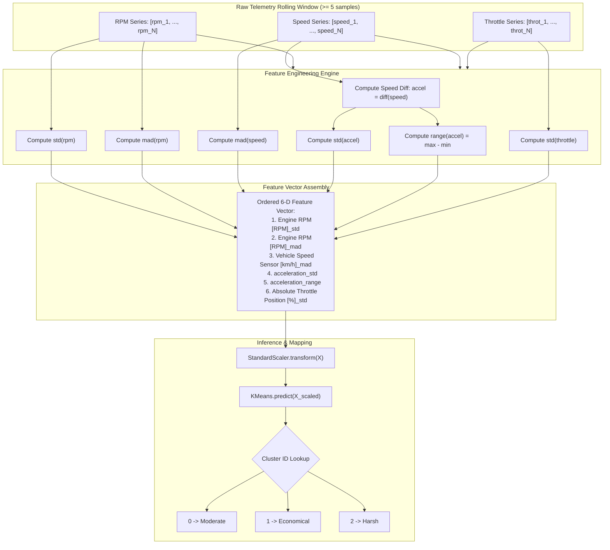

# K-Means Driver Behavior Profiling Model

This document provides a comprehensive technical overview of the **Driver Behavior Profiling** module in ECU Guardian, powered by an unsupervised **K-Means Clustering** model and a **StandardScaler** preprocessor.

---

## 1. Overview & Objectives

Driver behavior analysis is critical for modern automotive telematics, fleet management, and predictive maintenance. Aggressive driving styles (frequent high-RPM bursts, rapid acceleration, harsh braking, and sudden throttle fluctuations) directly accelerate engine wear, degrade transmission health, and increase fuel consumption.

The objective of this model is to categorize short time-series windows of driving telemetry into one of three driver behavior profiles:
- **Economical** (Cluster 1) — Smooth driving, gentle acceleration, stable throttle, conservative RPM ranges.
- **Moderate** (Cluster 0) — Standard, balanced driving dynamics within typical operating bounds.
- **Harsh** (Cluster 2) — Aggressive acceleration, high RPM variance, rapid pedal transitions, abrupt speed fluctuations.

---

## 2. Model Artifacts

The trained artifacts reside under the `models/` directory:

| Artifact File | Format | Description |
| :--- | :--- | :--- |
| `models/kmeans_driver_behavior_model.joblib` | Joblib / Scikit-Learn | Fitted `KMeans` cluster estimator ($k = 3$) |
| `models/standard_scaler_driver_behavior.joblib` | Joblib / Scikit-Learn | Fitted `StandardScaler` containing training mean and variance |

Both artifacts are deserialized at server startup inside [`app/ml/driver_behaviour.py`](file:///e:/MP-ECU/ecu-backend/app/ml/driver_behaviour.py).

---

## 3. End-to-End Feature Engineering Pipeline

The model does not classify individual instantaneous data points. Instead, it operates over a **rolling time window** (minimum 5 continuous samples) consisting of three synchronized raw sensor signals:
1. **Engine RPM** ($x_{\text{rpm}}$) [RPM]
2. **Vehicle Speed** ($x_{\text{speed}}$) [km/h]
3. **Absolute Throttle Position** ($x_{\text{throttle}}$) [%]

From these raw time-series arrays, the system computes **6 hand-crafted statistical and dynamic features**.



---

## 4. Mathematical Feature Definitions

Let $X = (x_1, x_2, \dots, x_N)$ be a sequence of $N$ temporal observations ($N \ge 5$).

### 4.1 Standard Deviation ($\sigma$)
Quantifies the overall dispersion or volatility of the signal around its mean:
$$\sigma(X) = \sqrt{\frac{1}{N} \sum_{i=1}^{N} (x_i - \bar{x})^2}$$
Applied to:
- `Engine RPM [RPM]_std`: High variance indicates erratic revving.
- `Absolute Throttle Position [%]_std`: High variance reveals aggressive pedal pumping.

### 4.2 Mean Absolute Difference (MAD)
Calculates the average magnitude of instantaneous step-by-step changes:
$$\text{MAD}(X) = \frac{1}{N - 1} \sum_{i=2}^{N} |x_i - x_{i-1}|$$
Applied to:
- `Engine RPM [RPM]_mad`: Captures sudden engine surges.
- `Vehicle Speed Sensor [km/h]_mad`: Captures vehicle jerkiness and abrupt speed transitions.

### 4.3 Acceleration Derivation & Dynamics
Acceleration is derived from the first discrete difference of vehicle speed, prepending the initial speed to preserve array length:
$$a_1 = 0, \quad a_i = \text{speed}_i - \text{speed}_{i-1} \quad (\text{for } i \in \{2, \dots, N\})$$

From this acceleration series $A = (a_1, \dots, a_N)$, two features are extracted:
- `acceleration_std` = $\sigma(A)$: Spread of acceleration/deceleration forces.
- `acceleration_range` = $\max(A) - \min(A)$: Total dynamic range between peak acceleration and peak braking in the window.

---

## 5. Normalization & Clustering Model

### 5.1 Standard Scaling
Because RPM features operate on orders of thousands while throttle and acceleration range from 0 to 100 or single digits, distance-based algorithms like K-Means are dominated by RPM without normalization.

The pre-trained `StandardScaler` standardizes each feature to zero mean ($\mu$) and unit variance ($\sigma$):
$$z_j = \frac{x_j - \mu_j}{\sigma_j}$$

### 5.2 K-Means Objective
K-Means partitions the scaled feature space into $K = 3$ clusters by minimizing the Within-Cluster Sum of Squares (WCSS / inertia):
$$\arg\min_{S} \sum_{k=1}^{K} \sum_{\mathbf{z} \in S_k} \|\mathbf{z} - \boldsymbol{\mu}_k\|^2$$
where $\boldsymbol{\mu}_k$ represents the centroid of cluster $k$.

### 5.3 Cluster Mapping Table

Empirical profiling of the cluster centroids during model training yielded the following behavior mapping:

| Cluster ID | Behavior Profile | Characteristic Signatures |
| :---: | :---: | :--- |
| **`1`** | **Economical** | Lowest RPM standard deviation, smooth throttle transitions, minimal acceleration range. Typical of highway cruising or careful city driving. |
| **`0`** | **Moderate** | Moderate RPM variance, typical stop-and-go speed changes, average throttle adjustments. Typical everyday commuting. |
| **`2`** | **Harsh** | Spike in RPM std/mad, high acceleration range (hard launch followed by heavy braking), large throttle variance. High mechanical stress. |

---

## 6. API Serving Specification

The model is served through FastAPI via [`app/ml/driver_behaviour.py`](file:///e:/MP-ECU/ecu-backend/app/ml/driver_behaviour.py).

### Endpoint
`POST /api/driver/predict`

### Request Body (`WindowRequest`)
```json
{
  "rpm_values": [800.0, 850.0, 900.0, 1200.0, 1500.0, 1400.0, 1300.0],
  "speed_values": [0.0, 0.0, 5.0, 20.0, 35.0, 40.0, 38.0],
  "throttle_values": [10.0, 12.0, 15.0, 30.0, 45.0, 40.0, 35.0]
}
```

- Minimum length: 5 items per array.
- All three arrays must have identical length.

### Response (`200 OK`)
```json
{
  "cluster_id": 0,
  "behaviour_class": "Moderate",
  "features_debug": {
    "Engine RPM [RPM]_std": 262.83,
    "Engine RPM [RPM]_mad": 150.0,
    "Vehicle Speed Sensor [km/h]_mad": 7.0,
    "acceleration_std": 6.52,
    "acceleration_range": 17.0,
    "Absolute Throttle Position [%]_std": 13.22
  }
}
```

### Error Responses
- `400 Bad Request`: When arrays have fewer than 5 items (`"Not enough data points"`).
- `500 Internal Server Error`: Schema mismatch or invalid non-numeric inputs.

---

## 7. Evolution: LSTM + Random Forest Hybrid Pipeline

While K-Means effectively groups statistical summaries, summary statistics discard the **exact sequential order** of events (e.g., whether rapid braking preceded or followed throttle application). 

For details on the next-generation hybrid architecture incorporating sequence modeling, refer to [Hybrid LSTM + Random Forest Pipeline](file:///e:/MP-ECU/ecu-backend/docs/driver_behaviour_lstm_rf.md).
