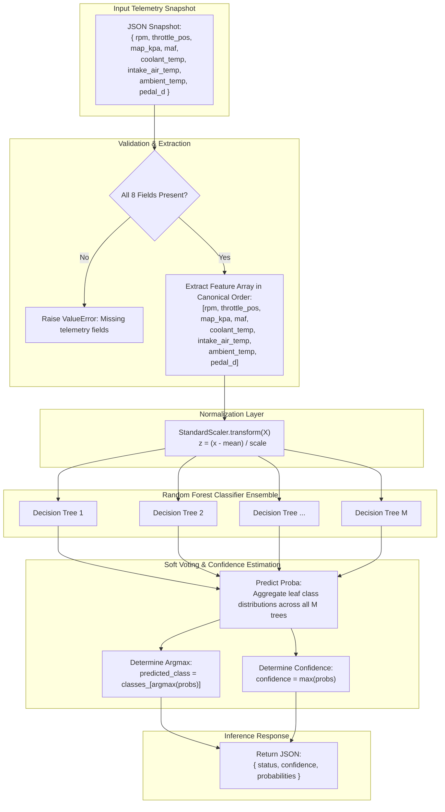

# Random Forest Vehicle Health Classification Model

This document details the architecture, feature space, preprocessing, and inference lifecycle of the **Vehicle Health Classifier** in ECU Guardian, implemented using an ensemble **Random Forest Classifier** and a **StandardScaler** preprocessor.

---

## 1. Overview & Operational Role

Modern Electronic Control Units (ECUs) continuously manage powertrain performance through closed-loop feedback across dozens of physical sensors. Deviations from expected combustion and thermal states can signal impending mechanical breakdown, cooling system failure, vacuum leaks, sensor drift, or throttle actuator malfunction.

The **Vehicle Health Classifier** performs multi-sensor anomaly classification on instantaneous OBD-II telemetry snapshots. Rather than relying solely on hard Diagnostic Trouble Code (DTC) threshold triggers (which often fire only after significant subsystem failure), this machine learning model detects multi-dimensional correlation faults and classifies vehicle operating health into:
- **`Normal`** — Subsystems operating within calibrated mechanical parameters.
- **`Warning`** — Mild telemetry deviations, early-stage thermal or airflow discrepancies, sub-optimal air-fuel ratios.
- **`Critical`** — Severe condition (e.g., overheating, acute pressure imbalance, throttle/pedal divergence), requiring immediate shutdown or service.

---

## 2. Model Artifacts

The artifacts are stored in the `models/` directory:

| Artifact File | Format | Description |
| :--- | :--- | :--- |
| `models/random_forest_health.pkl` | Pickle / Joblib | Trained `RandomForestClassifier` ensemble model |
| `models/scaler_health.pkl` | Pickle / Joblib | Trained `StandardScaler` holding empirical feature means and standard deviations |

Both artifacts are loaded into memory once at process startup in [`app/ml/health_classifier.py`](file:///e:/MP-ECU/ecu-backend/app/ml/health_classifier.py) to guarantee sub-millisecond inference latency.

---

## 3. Telemetry Feature Set & Sensor Physics

The model expects an 8-dimensional feature vector. The features and their physical engineering significance are described below:

| Feature Key | Parameter Name | OBD-II PID / Unit | Physical Role in Fault Detection |
| :--- | :--- | :---: | :--- |
| `rpm` | Engine Rotational Speed | PID `0x0C` (RPM) | Engine crankshaft velocity. Discrepancies between RPM and throttle identify stalls, misfires, or slipping clutches. |
| `throttle_pos` | Absolute Throttle Position | PID `0x11` (%) | Physical butterfly valve angle. Divergence from pedal position indicates drive-by-wire actuator faults. |
| `map_kpa` | Manifold Absolute Pressure | PID `0x0B` (kPa) | Air pressure inside the intake manifold. Key indicator for vacuum leaks, turbo boost pressure, and engine load. |
| `maf` | Mass Air Flow Rate | PID `0x10` (g/s) | Mass flow rate of intake air. Essential for calculating stoichiometric fuel injection; fouled sensors cause lean/rich conditions. |
| `coolant_temp` | Engine Coolant Temperature | PID `0x05` (°C) | Internal engine thermal balance. Temperatures exceeding 105°C indicate radiator, water pump, or thermostat issues. |
| `intake_air_temp` | Intake Air Temperature (IAT) | PID `0x0F` (°C) | Air density proxy. Extreme values skew fuel metering calculations and affect ignition timing advance. |
| `ambient_temp` | Ambient Air Temperature | PID `0x46` (°C) | Environmental baseline reference. Used to establish thermal delta: $\Delta T = T_{\text{coolant}} - T_{\text{ambient}}$. |
| `pedal_d` | Accelerator Pedal Position D | PID `0x49` (%) | Driver throttle demand sensor potentiometer D. Paired with `throttle_pos` to detect electronic throttle control (ETC) errors. |

---

## 4. Pipeline & Inference Architecture

The end-to-end inference flow maps an incoming JSON telemetry payload through field validation, standardization, random forest tree traversal, soft probability voting, and confidence scoring.



---

## 5. Random Forest Ensemble Mechanics

### 5.1 Why Random Forest for Vehicle Health?
1. **Non-Linear Decision Boundaries**: Automotive sensor physics exhibits non-linear relationships (e.g., manifold pressure vs. throttle angle changes dramatically across different RPM bands).
2. **Robustness to Sensor Noise**: OBD-II data contains high-frequency electrical and quantization noise. Random forests reduce variance through bootstrap aggregation (bagging).
3. **Calibrated Probabilities**: By computing class fractions across all constituent decision trees, the model yields well-calibrated posterior probabilities $P(\text{Status} = c \mid \mathbf{x})$, vital for safety-critical alerting thresholds.

### 5.2 Confidence and Probability Formulation
For an ensemble of $M$ decision trees, each tree $t$ outputs an estimated probability distribution over classes $C = \{\text{Normal}, \text{Warning}, \text{Critical}\}$:
$$P(y = c \mid \mathbf{x}) = \frac{1}{M} \sum_{t=1}^{M} P_t(y = c \mid \mathbf{x})$$

The final predicted class $\hat{y}$ and confidence score are calculated as:
$$\hat{y} = \arg\max_{c \in C} P(y = c \mid \mathbf{x})$$
$$\text{confidence} = \max_{c \in C} P(y = c \mid \mathbf{x})$$

---

## 6. API Serving Specification

The model is exposed via [`app/ml/health_classifier.py`](file:///e:/MP-ECU/ecu-backend/app/ml/health_classifier.py) and mounted in [`app/main.py`](file:///e:/MP-ECU/ecu-backend/app/main.py).

### Endpoint
`POST /api/health/predict`

### Request Headers
`Content-Type: application/json`

### Request Body (`HealthSnapshotRequest`)
```json
{
  "rpm": 1500.0,
  "throttle_pos": 30.0,
  "map_kpa": 97.0,
  "maf": 10.0,
  "coolant_temp": 90.0,
  "intake_air_temp": 25.0,
  "ambient_temp": 24.0,
  "pedal_d": 20.0
}
```

### Response (`200 OK`)
```json
{
  "status": "Normal",
  "confidence": 0.9874,
  "probabilities": {
    "Normal": 0.9874,
    "Warning": 0.0126
  }
}
```

### Response on Degraded/Warning Telemetry Example
```json
{
  "status": "Warning",
  "confidence": 0.8421,
  "probabilities": {
    "Normal": 0.1579,
    "Warning": 0.8421
  }
}
```

### Error Responses
- `422 Unprocessable Entity`: Missing required keys or invalid field datatypes in Pydantic schema validation.
- `500 Internal Server Error`: Any uncaught exception during feature scaling or model execution.

---

## 7. Integration with the Live Simulator

When the OBD-II simulator is streaming data (over WebSocket `/api/ws/live` or `/api/live-data`), every tick outputs telemetry with matching field names: `rpm`, `throttle_pos`, `map_kpa`, `maf`, `coolant_temp`, `intake_air_temp`, `ambient_temp`, and `pedal_d`. 

Downstream client applications can directly pipe `live_data.data` objects into `/api/health/predict` without field renaming or transformations.
